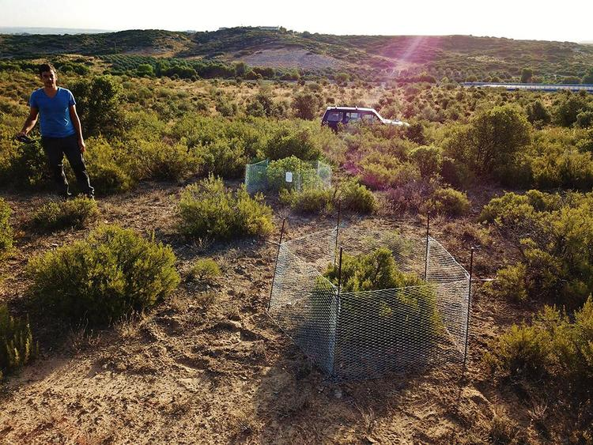

```{r setup, include=FALSE}
knitr::opts_chunk$set(echo = TRUE)
```

# Exercise 1

## Create a new Rmd file called “shrub_volume.Rmd”. Write a short paragraph describing the data set before starting your analysis. Include a figure.

The dataset is based on a study of the factors that control the size and carbon storage of shrubs. An experiment in which the effects of three various treatments on shrub volume located in four different areas is seen. The site describes the area in which the scrubs are seen. The experiment describes thich type of treatment is implemented on the shrubs. The length, width, and height, constitue measurement factprs that are utilized to determine the volume of each of the shrubs. 

```{r}

library(magrittr)
library(dplyr)
```

## Import the data set using read.csv(). Assign it to an object called shrubs.

```{r}
shrubs <- read.csv(file = "../data-raw/shrub-volume-data.csv")
```

## Select the data from the “length” column and print it out (using select()).

```{r}
select(shrubs, length) %>% print()
```

## Select the data from the site and experiment columns and print it out (using select()).

```{r}
select(shrubs, site, experiment) %>% print()
```

## Add a new column named “area” containing the area of the shrub, which is the length times the width (using mutate()).

```{r}
mutate(shrubs, area = length*width)
```

## Sort the data by length (using arrange()).

```{r}
arrange(shrubs, length)
```

## Filter the data to include only plants with heights greater than 5 (using filter()).

```{r}
filter(shrubs, height > 5)
```

## Filter the data to include only plants with heights greater than 4 and widths greater than 2 (using , or & to include two conditions).

```{r}
filter(shrubs, height > 4 & width > 2)
```

## Filter the data to include only plants from Experiment 1 or Experiment 3 (using | for “or”).

```{r}
filter(shrubs, experiment == 1 | experiment == 3)
```

## Filter the data to remove rows with null values in the height column (using !is.na)

```{r}
filter(shrubs, !is.na(height))
```

## Create a new data frame called shrub_volumes that includes all of the original data and a new column containing the volumes (length * width * height), and display it.

```{r}
mutate(shrubs, volume = length*width*height) %>%
  select(site, experiment, length, width, height, volume)
```

# Exercise 2

## Modify the code to calculate and print the average height of a plant in each experiment.
```{r}
shrub_dims <- read.csv('../data-raw/shrub-volume-data.csv')
by_experiment <- group_by(shrub_dims, experiment)
avg_height_by_experiment <- summarize(by_experiment, avg_height = mean(height))
avg_height_by_experiment
```

## Use max() to determine the maximum height of a plant at each site.

```{r}
shrub_dims <- read.csv('../data-raw/shrub-volume-data.csv')
by_site <- group_by(shrub_dims, site)
max_height <- summarize(by_site, max_height = max(height))
max_height
```

## Write the same code but as a pipeline (using the pipe |> or *>*) to get the same result.

```{r}
shrub_dims <- read.csv('../data-raw/shrub-volume-data.csv')
  avg_height <- shrub_dims %>%  
  group_by(site) %>%
  summarize(avg_height = mean(height))
```

```{r}
shrub_dims <- read.csv('../data-raw/shrub-volume-data.csv')
avg_height_by_experiment <- shrub_dims %>%
  group_by(experiment) %>%
  summarize(avg_height = mean(height))
avg_height_by_experiment
```

```{r}
shrub_dims <- read.csv('../data-raw/shrub-volume-data.csv')
max_height <- shrub_dims %>%
  group_by(site) %>%
  summarize(max_height = max(height))
max_height
```

# Exercise 3

## Fix the errors in the code so that it does what it’s supposed to.
## Add a comment to the end of each line of code explaining what it does.

When importing the data we need to ensure that we show the location of where it is, so our R studio can know where to find the file or dataset.

```{r}
read.csv("../data-raw/shrub-volume-data.csv")
```

We need to create a new object labeled as shrub_data using the data. After importing the data using the `read.csv` function, it is important to assign it to an object; in this case, shrub-data. 

```{r}
shrub_data <- read.csv("../data-raw/shrub-volume-data.csv")
```

After assigning the dataset to an object we can use the object and pipeline to start it off

```{r}
shrub_data <- read.csv("../data-raw/shrub-volume-data.csv")
svc <- shrub_data %>%
  mutate(volume = length * width * height) %>%
  group_by(site) %>%
  summarize(mean_volume = mean(volume))
```

When using summarize, instead of the mean volume taking the average of the volumes, it took the maximum of the volumes , which is incorrect. To fith this, the `max` function was changed to the `mean` function.


```{r}
shrub_data <- read.csv("../data-raw/shrub-volume-data.csv")
sve <- shrub_data %>%
  mutate(volume = length * width * height) %>%
  group_by(experiment) %>%
  summarize(mean_volume = mean(volume))
```

This shows the correct code to import the shrub volume data and calculate the average shrub volume for each site and, separately, for each experiment.

Homework: Shrub volume data set - part 2

# Exercise 4

## Import the experiments data and then use inner_join() to combine it with the shrub dimensions data to add a "manipulation" column to the shrub data.

```{r}
shrub_data <- read.csv("../data-raw/shrub-volume-data.csv")
shrub_volume_experiments <- read.csv("../data-raw/shrub-volume-experiments.csv")
shrub_volume_sites <- read.csv("../data-raw/shrub-volume-sites.csv")

combined_sd <- inner_join(shrub_data, shrub_volume_experiments, by = "experiment")
combined_full_sd <- inner_join(combined_sd, shrub_volume_sites, by = "site")

combined_full_sd
```

# Exercise 5

## The smallest value of length, width and height.
```{r}
length <- c(2.2, 2.1, 2.7, 3.0, 3.1, 2.5, 1.9, 1.1, 3.5, 2.9)
width <- c(1.3, 2.2, 1.5, 4.5, 3.1, NA, 1.8, 0.5, 2.0, 2.7)
height <- c(9.6, 7.6, 2.2, 1.5, 4.0, 3.0, 4.5, 2.3, 7.5, 3.2)
```

The smallest value of:
length: 1.1
width: 0.5
height: 1.5

The largest value of:
length: 3.5
width: 4.5
height: 9.6

The sum value of:
length: 25
width: 19.6
height: 45.4

The average value of:
length: 2.5
width: 2.178
height: 4.540

```{r}
min(length, na.rm = TRUE)
min(width, na.rm = TRUE)
min(height, na.rm = TRUE)

max(length, na.rm = TRUE)
max(width, na.rm = TRUE)
max(height, na.rm = TRUE)

sum(length, na.rm = TRUE)
sum(width, na.rm = TRUE)
sum(height, na.rm = TRUE)

mean(length, na.rm = TRUE)
mean(width, na.rm = TRUE)
mean(height, na.rm = TRUE)
```


The volume of each shrub (length × width × height). Storing this as an object or variable will make some of the next problems easier.
```{r}
volume <- length*width*height
volume
```

The sum of the volume of all of the shrubs.
224.379

```{r}
sum(volume, na.rm = TRUE)
```

A vector of the height of shrubs with lengths > 2.5.
```{r}
height_2.5 <- subset(height, height > 2.5)
height_2.5
```

A vector of the height of shrubs with heights > 5.
```{r}
height_5 <- subset(height, height > 5)
height_5
```

A vector of the heights of the first 5 shrubs (using []).
```{r}
height_first_5 <- height[1:5]
height_first_5
```

A vector of the volumes of the first 3 shrubs (using []).
```{r}
volume_first3 <- volume[1:3]
volume_first3
```

A vector of the volumes of the last 5 shrubs with the code written so that it will return the last 5 values regardless of the length of the vector (i.e., it will give the last 5 values if there are 10, 20, or 50 individuals).

```{r}
volume_last5 <- tail(volume, n = 5)
volume_last5
```

# Exercise 6

A vector of shrub lengths
```{r}
shrub_dimensions_labeled <- read.csv("../data-raw/shrub-dimensions-labeled.csv")

shrub_length <- shrub_dimensions_labeled$length
```

A vector of the volume of each of the shrubs
```{r}
shrub_height <- shrub_dimensions_labeled$height
shrub_width <- shrub_dimensions_labeled$width
volume_dimensions <- shrub_length*shrub_height*shrub_width
```

A data frame with just the shrubID and height columns
```{r}
df_id_height <- select(shrub_dimensions_labeled, shrubID, height) 
```

A data frame with the second row of the full data frame
```{r}
df_second_row <- shrub_dimensions_labeled[2,]
```

A data frame with the first 5 rows of the full data frame
```{r}
df_first_five_rows <- shrub_dimensions_labeled[1:5,]
```


